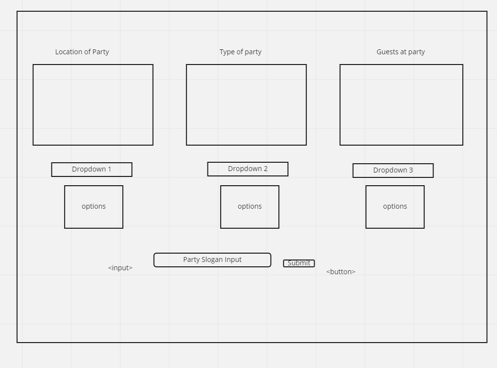

# Html

    <section>

        
 for location container
        <select> for location dropdown
            <options> for dropdown options
        
 for type container
        <select> for type dropdown
            <options> for dropdown options
        
 for guest container
        <select> for guest dropdown
            <options> for dropdown options
    </section>
    <section>
        
 for slogan section
            <input> for slogan input
    </section>

# State

    -images that change according to dropdown image
    -dropdown menus and options
    -slogan input that will update slogans
    -list of slogans

# Events

    - 3 dropdown menus with event listener 'change'
    - track all slogan inputs from user
    - track how many times each dropdown option has been changed
